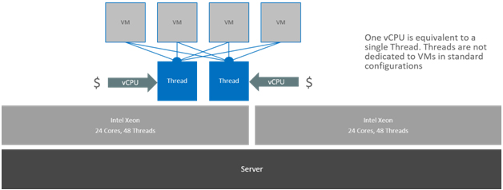
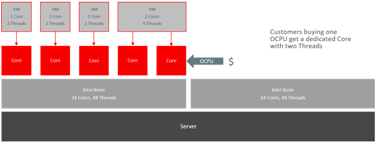

As cloud computing popularity rises, it is very important for everyone to be able to estimate cloud costs and compare offers from different vendors. For this purposes, it is necessary to understand the basic metrics behind pricing in the cloud - vCPU and OCPU.

1. vCPU

AWS, Microsoft and Google use vCPU as compute performance unit. Each vCPU is defined as a hyperthread of an Intel Xeon core. A standard Intel processor core with hyperthreading enabled has 2 threads.

As described on picture above, one vCPU is equivalent to a single thread. Threads are not dedicated to VMs in standard configurations which is the key difference to Oracle metric - OCPU.

2. OCPU

Oracle Cloud Infrastructure measure for compute. An OCPU is defined as the CPU capacity equivalent of one physical core of an Intel Xeon processor with hyper threading enabled, or one physical core of an Oracle SPARC processor.

For Intel Xeon processor each OCPU corresponds to two hardware execution threads, known as vCPUs. For Oracle SPARC processors, one OCPU corresponds to eight hardware execution threads, also known as vCPUs.

As described on picture above, customers buying one OCPU get a dedicated physical core with two threads.

3. Examples

Now let's compare OCPU and vCPU on some real OCI shapes.

Bare Metal instances:

BM.Standard2.52 shape - dedicated two socket Oracle x86 server powered by customized processor Intel Xeon 2.0 GHz Platinum 8167M. Server contains 52 physical cores (52 OCPU) in total. The equivalent to 52 OCPUs would be 104 vCPU (threads).

Virtual Machine instances:

VM.Standard1.1 shape - virtual machine powered by processor Intel Xeon 2.3 GHz E5-2699 v3. Processor contains 18 physical cores (18 OCPU) and in this specific shape, the customer is provisioned with 1 physical core (OCPU). The equivalent to 1 OCPU would be 2 threads.

To sum it up, when comparing offers or just talking to different providers, better use measure "thread" instead of "core", "processor" or "CPU".
